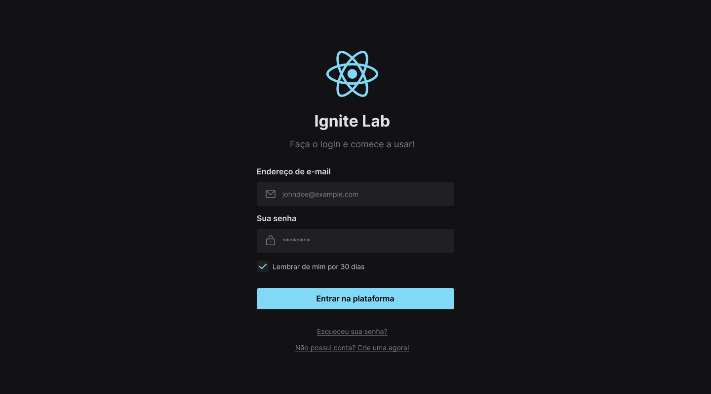
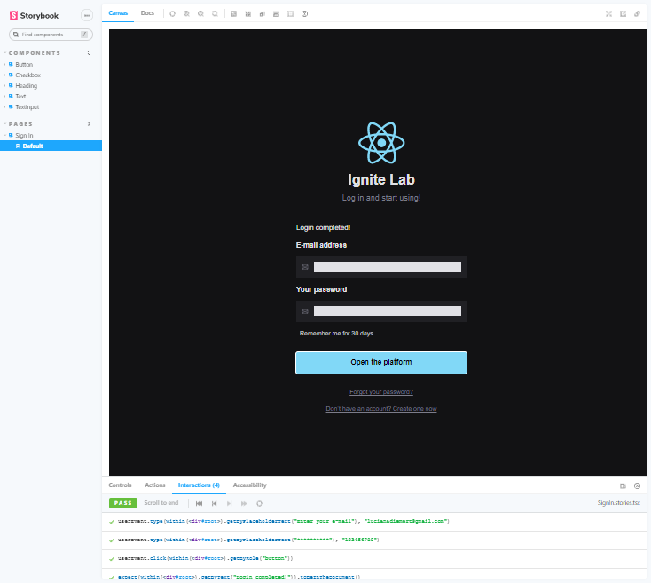

# Ignite-lab-design-system

<h1 align="center">
  Design System | Ignite Lab
</h1>

  
  
  
  

 

  
  

## 💻 Project

About:
 - Project developed during the Ignite Lab #3 da Rocketseat 🚀 in which we built a design system of the Figma to React.
 - We created the visual base of our Design System in Figma, and defined which tokens we would use and the components that would be part of the library in React. 
 - We then exported the tokens and components from Figma into code, creating the base of the Design in React and the documentation using Storybook.

## Days Event:
 - Class 01 => First Steps! In this lesson, we will create the visual base of the Design System in Figma, define which tokens we will use, and the components that will be part of the library in React.
 - Class 02 => From Figma to React, creating a hands-on application! In the second lesson, we will export the tokens and components from Figma to code creating the project base in React and the documentation using Storybook.
 - Class 03 => Testing and Automating Let's finish our project! In the last lesson, we will learn how to create automated tests for the Design System and simulate user interactions. Also, we will automate the deployment process.

## ✨ Technologies
This application was developed with the following technologies:

- [React](https://reactjs.org)
- [TypeScript](https://www.typescriptlang.org/)
- [Tailwind](https://tailwindcss.com/)
- [Radix UI](https://www.radix-ui.com/)
- [Storybook](https://storybook.js.org/)
- [Figma](https://www.figma.com/)

## Project Usage

### 💾 Download project
Clone the repository to have a version of the project on your machine: 
`$ git clone https://github.com/ludiemert/ignite-lab-design-system.git`

### 🧰 Install Dependencies
`$ npm install ou yarn`  

### 🚀 Start the project
`$ npm run dev ou yarn dev`    

`$ npm run storybook`

 

## 📝 License
This project is licensed under the terms of the [MIT](https://github.com/ludiemert/ignite-lab-design-system/blob/main/LICENSE). 

----
### Contato

### [**Luciana Diemert**](https://github.com/ludiemert)

🛠 `Frontend` Developer Jr.  
📍 São Jose dos Campos – SP - Brazil

&nbsp;&nbsp;&nbsp;&nbsp;

 

## 🎁 Acknowledgements and dedications

* Thank you #Rocketseat team
